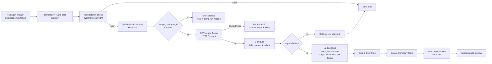

---
tags:
  - n8n
  - plan
  - blincer
  - nivel-3
client: blincer
flow: credit-limit-invoice-block
updated: 2026-06-02
status: blocked-by-oqs
---

# Plan — Bloqueo automático de facturación por deuda

← Volver a [[n8n/METHODOLOGY|Methodology]] · [[n8n/clients/blincer/flows/credit-limit-invoice-block/spec|Spec]] · [[n8n/clients/blincer/flows/credit-limit-invoice-block/research|Research]]

> ⚠️ **BLOQUEADO** — este plan **NO** debe ejecutarse hasta resolver OQ-1, OQ-2, OQ-3, OQ-4 del spec y OQ-G1 (Tango), OQ-G7 (canal alerta) del README de Blincer. Lo que sigue es la **arquitectura propuesta** asumiendo Tango Nexo + HubSpot Pro+ + bloqueo "Flag + stage" (variante B de OQ-4). Re-validar cuando se resuelvan.

> [!note] Build 2026-05-31 — skeleton importable
> `workflow.json` construido a mano (sin MCP n8n). Nodos **disabled**: `Get current debt (Tango)` (OQ-1/OQ-G1) y `Send internal alert` (OQ-G7). Resto activo para testear punta a punta. `active: false`. Reemplazar `REPLACE_*` y mapear credenciales antes de activar.

> [!success] Progreso 2026-06-02 — Sheets cableados
> Backing en el spreadsheet **Blincer - Credit Limit** (`1kjsp67c8eKVTqj6FoHpKI6mTtqoTFsBSUdEv9E0gPaI`). Tabs: `audit_credit_block`, `idempotency_credit` (la `errors_credit_block` del plan **aún no**). `REPLACE_SHEET_ID` reemplazado y credencial Sheets mapeada. El nodo `Idempotency lookup` quedó **disabled** (op `lookup` inexistente en googleSheets v4.5 + falta write-back — ver [[n8n/nodes/google-sheets|node note]]). Faltan todavía: stage id real (`REPLACE_STAGE_ID`), Tango y canal de alerta.

> [!success] Progreso 2026-06-02 (dedup real + error workflow)
> **Dedup implementada** (patrón [[n8n/patterns/sheet-idempotency|Sheet-based idempotency]]): `Idempotency lookup` ahora es un `read` de `idempotency_credit` (`alwaysOutputData`) → `Dedup filter` (Code) filtra por clave `eventId` (o `objectId_occurredAt`) → write-back `Idem row`→`Idem write` desde ambas ramas terminales (`Log allowed` y `Append audit (blocked)`). Asignado **Error Workflow** `T-000` (`9zlznI4wuzz6MNSX`). Validado estructuralmente; sin test de runtime (falta credencial HubSpot + OQs).

> [!success] Progreso 2026-06-02 (HubSpot + disparo por webhook)
> - **Trigger migrado:** se eliminó `HubSpot Deal Trigger` (developer API) y se reemplazó por nodo **Webhook** (`POST /webhook/blincer-credit-limit`) + **`Normalize webhook`** (Code) que mapea el body de HubSpot a los campos canónicos (`objectId`, `propertyValue`, `eventId`, `occurredAt`) — patrón [[n8n/patterns/hubspot-workflow-webhook-trigger|HubSpot Workflow → n8n Webhook]]. `Get Deal` ya referencia `$('Normalize webhook')`. **Falta del lado HubSpot:** crear un Workflow nativo "Deal entra a *Listo para facturar* → Send webhook (POST)" a esa URL.
> - **Credencial HubSpot:** creada `hubspot-blincer-apptoken` (tipo App Token, id `A3JekIL652cjutl4`) y enganchada a los 5 nodos de acción (`authentication: appToken`). ⚠️ **El token provisto fue rechazado por HubSpot** ("OAuth token expired / expiresAt: 0" → truncado o revocado): pegar un **Private App token válido** en esa credencial desde la UI de n8n para que funcione.
> - **Sigue pendiente** (necesita token vivo): resolver `REPLACE_STAGE_ID_listo_para_facturar` y el stage "Bloqueado por deuda" (se leen de `GET /crm/v3/pipelines/deals`). Tango y alerta interna siguen igual.

---

## Architecture (propuesta, asume rama Nexo)

## Nodes

| # | Node | Type | Purpose | Key params | On error |
| --- | --- | --- | --- | --- | --- |
| 1 | `Webhook (HubSpot)` + `Normalize webhook` | `webhook` + `code` | Recibir POST de un HubSpot Workflow ("Deal → Listo para facturar") y normalizar a `objectId`/`propertyValue`/`eventId`/`occurredAt` (reemplazó al `hubspotTrigger`, ver [[n8n/patterns/hubspot-workflow-webhook-trigger\|pattern]]) | path `blincer-credit-limit` | n/a (trigger) |
| 2 | `Filter stage` | `n8n-nodes-base.if` | Continuar solo si `propertyValue` == stage "Listo para facturar" | condition con stage id (a resolver post-OQ-6) | route to End |
| 3 | `Idempotency check` | `n8n-nodes-base.googleSheets` o `n8n-nodes-base.postgres` (decidir en build) | Lookup por `eventId + occurredAt` para descartar reentregas | sheet/table `idempotency_credit_block` | si lookup falla → log + reintentar |
| 4 | `Get Deal` | `n8n-nodes-base.hubspot` | Fetch deal + associations company | resource=deal, operation=get, includeAssociations=true | retry 3× con backoff exponencial; si persiste → error branch |
| 5 | `Get Company` | `n8n-nodes-base.hubspot` | Properties: `tango_customer_id`, `credit_limit_ars` | resource=company, operation=get | igual que #4 |
| 6 | `Validate mapping` | `n8n-nodes-base.if` | Branch si `tango_customer_id` está vacío | condition | route to `Error branch (no mapping)` |
| 7 | `Get current debt` | `n8n-nodes-base.httpRequest` | GET deuda viva del cliente en Tango Nexo (o reemplazar por reader local si OQ-G1=local) | URL, Bearer, timeout=10s | retry 1× a 5s; si persiste → `Fail-safe block branch` |
| 8 | `Compute decision` | `n8n-nodes-base.function` | `proyectado = current_debt + deal_amount`; `block = proyectado > credit_limit` | JS inline | n/a |
| 9 | `If block` | `n8n-nodes-base.if` | Switch allow/block | condition `block === true` | n/a |
| 10a | `Log allowed` | sheets/postgres node | row `{deal_id, decision: 'allowed', timestamp, ...montos}` | sheet/table `audit_credit_block` | retry 3× |
| 10b | `Update Deal (block)` | `n8n-nodes-base.hubspot` | set `block_invoice=true`, move stage | properties | retry 3×; on fail → alerta crítica a Sandra |
| 11 | `Create Deal Note` | `n8n-nodes-base.hubspot` | Texto explicativo con montos | objectType=deal | retry 3× |
| 12 | `Create Company Note` | `n8n-nodes-base.hubspot` | Misma info, asociada a Company | objectType=company | retry 3× |
| 13 | `Send internal alert` | depende de OQ-G7 | Mensaje a Sandra | template msg | retry 3×; on fail → fallback a email |
| 14 | `Append audit log` | sheets/postgres node | row `{decision: 'blocked', ...}` | sheet/table `audit_credit_block` | retry 3× |
| E1 | `Error branch (no mapping)` | function + alert | Note + alerta "Falta `tango_customer_id` para deal X" | — | append to error log |
| E2 | `Fail-safe block branch` | branch | Tratar como `block=true` + alerta "Bloqueo no verificado, Tango down" | — | append to error log |

## Cross-cutting decisions

### Idempotency

- **Dedup key:** `hubspot_eventId + occurredAt` (HubSpot puede reentregar el mismo webhook).
- **Strategy:** lookup-then-insert en tabla `idempotency_credit_block` (Sheet o Postgres). TTL 7 días.
- **Why:** HubSpot reentrega; queremos idempotencia que sobreviva a re-runs manuales del workflow desde n8n UI también.

### Error handling

- **Retry policy:** 3 intentos con backoff exponencial 2s/4s/8s en todos los nodos de I/O (HubSpot, Tango, alertas).
- **Dead-letter:** Sheet `errors_credit_block` con `{deal_id, node, error, timestamp, payload}`. Cron diario 09:00 ART notifica a Sandra si hay rows nuevos.
- **Alerting:** alerta inmediata a canal interno (OQ-G7) cuando:
  - `Update Deal` falla (estado inconsistente: deuda excedida pero deal no bloqueado).
  - `Get current debt` falla → fail-safe block + alerta crítica.

### Credentials & secrets

| Credential | n8n credential name | Stored in | Owner |
| --- | --- | --- | --- |
| HubSpot Private App | **`hubspot-blincer-apptoken`** (id `A3JekIL652cjutl4`, tipo App Token) — creada y enganchada; ⚠️ token provisto rechazado, pegar uno válido | n8n credentials | Innova (token rotable) |
| Tango Nexo API | `tango-nexo-blincer` (si aplica, a crear) | n8n credentials | Innova (delegado por Sandra) |
| Google Sheets (audit) | **`Google Sheets account`** (`NNpCFCk3F2rhlxUk`, reusa la de BLINCER-T0xx) | n8n credentials | Innova |
| Canal alerta interna | `internal-alert-blincer` (a crear) | n8n credentials | depende de OQ-G7 |

No secrets inline. Toda referencia vía `{{$credentials.*}}` o `{{$env.*}}` para flags no sensibles.

### Observability

- **Logs:** cada execution queda en n8n executions list. Custom log a Sheet `audit_credit_block` con decisión + montos + duración.
- **Run history retention:** retener 30 días de execution data en n8n.
- **Failure detection:** cron diario lee `errors_credit_block`; si hay rows nuevas → alerta a Sandra. Adicionalmente, alerting en tiempo real para fallos críticos (ver Error handling).
- **Métricas a trackear desde el día 1:** `# deals procesados/día`, `# bloqueados`, `# allowed`, `# error branch`, `p95 duración del flow`.

### Testing

- **Test payloads:** ver `./test-payloads/` (crear en build):
  - `deal_below_limit.json` — debt + amount < limit → debe terminar en `Log allowed`.
  - `deal_above_limit.json` — debt + amount > limit → flag + stage + alerta.
  - `deal_no_mapping.json` — company sin `tango_customer_id` → error branch.
  - `tango_timeout.json` (simulado con mock URL) → fail-safe block.
- **Environment:** desarrollo en HubSpot sandbox del cliente si está habilitado; si no, en un Deal de prueba etiquetado `test-do-not-bill` con un Company sintético.
- **Rollback:** si la primera prod-run rompe data, revertir Update Deals con un script de unset que mire el Sheet `audit_credit_block` para las últimas N rows.

## Risks & mitigations

| Risk | Likelihood | Impact | Mitigation |
| --- | --- | --- | --- |
| Tango es local sin API | Media | Alto — el flow real depende de exportes CSV con latencia ≥ 1 día | Bloqueo preventivo con last-known snapshot + timestamp visible en la alerta; plantear migración Nexo en Fase 0 |
| HubSpot reentrega webhooks | Alta | Medio — duplica Notes y alertas | Idempotency check en nodo 3 (ya en el plan) |
| Falta mapeo `tango_customer_id` | Alta inicial, baja una vez backfilled | Medio — falsos negativos (no bloquea cuando debería) | Validate mapping branch + alerta "falta mapeo" que fuerza backfill |
| Tango Nexo cambia API sin previo aviso | Baja | Alto | Health check diario que llama un endpoint conocido; alerta si 4xx/5xx persistente |
| Sandra cambia el límite y el flow usa cache vieja | Baja | Medio | Siempre fetchear `credit_limit_ars` desde HubSpot en cada execution; no cachear |
| LLM-generated false positive (n/a) | n/a | n/a | Este flow no usa LLM |

## Open dependencies before build

- [ ] Resolver OQ-1, OQ-2, OQ-3, OQ-4 del spec.
- [ ] Resolver OQ-G1 (Tango versión), OQ-G7 (canal alerta) del README de Blincer.
- [ ] Crear custom properties en HubSpot: `credit_limit_ars` (number), `block_invoice` (bool), `tango_customer_id` (string en Company).
- [ ] Crear stages en pipeline HubSpot: "Listo para facturar", "Bloqueado por deuda" (slugs definitivos a registrar acá una vez creados).
- [ ] Crear Sheets / tablas: `idempotency_credit_block`, `audit_credit_block`, `errors_credit_block`.
- [ ] Backfill inicial de `tango_customer_id` en HubSpot Companies (one-shot, fuera de este flow).
