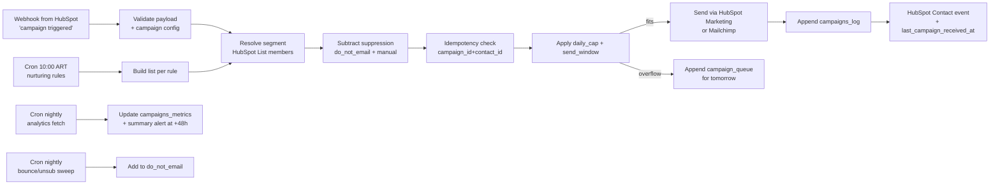

---
tags:
  - n8n
  - plan
  - blincer
  - nivel-3
client: blincer
flow: email-remarketing
updated: 2026-05-29
status: blocked-by-oqs
---

# Plan — Remarketing y difusiones por email

← Volver a [[n8n/METHODOLOGY|Methodology]] · [[n8n/clients/blincer/flows/email-remarketing/spec|Spec]] · [[n8n/clients/blincer/flows/email-remarketing/research|Research]]

> ⚠️ **BLOQUEADO** — pendiente OQ-1 (HubSpot Marketing vs Mailchimp) principalmente. Asumimos **HubSpot Marketing Hub** para diseñar (ya tienen HubSpot Pro+; sumar Marketing es menos infra y elimina la sincronización con Mailchimp). Si se elige Mailchimp, el plan cambia básicamente en el nodo de send.

> [!note] Build 2026-05-31 — skeleton importable
> `workflow.json` con el flow principal + las 3 cadenas cron secundarias (analytics, suppression sweep, queue flush) en el mismo archivo (separar en workflows propios en prod). Nodos **disabled**: `Send via platform` y `Get platform analytics` (OQ-1 HubSpot Marketing vs Mailchimp), `Notify Guillermo` y `Send 48h summary` (OQ-G7/OQ-7). Dry-run gate activo por default. `active: false`.

---

## Architecture

## Nodes (workflow principal)

| # | Node | Type | Purpose | On error |
| --- | --- | --- | --- | --- |
| 1 | `Webhook campaign` | `webhook` | trigger A | n/a |
| 1' | `Cron nurturing` | `scheduleTrigger` | trigger B | n/a |
| 2 | `Read campaign config` | `googleSheets` | leer `campaigns_config` por `campaign_id` | retry 3× |
| 3 | `Dry-run gate` | `if` | si `mode=dry-run`, listar destinatarios y notificar a Guillermo sin enviar | n/a |
| 4 | `Resolve segment` | `hubspot` | listar members de la HubSpot List | retry 3× |
| 5 | `Load suppression` | `hubspot` + `googleSheets` | merge `do_not_email` + `manual_suppression` | retry 3× |
| 6 | `Subtract suppression` | `function` | filter contacts | n/a |
| 7 | `Idempotency check` | `googleSheets` lookup | por `(campaign_id, contact_id)` en `campaigns_log` | retry 3× |
| 8 | `Apply caps & window` | `function` | split en "send_now" vs "queue_for_tomorrow" según `daily_cap` y `send_window` | n/a |
| 9 | `Send (HubSpot Marketing)` | `hubspot` (marketing email) o `mailchimp` | enviar email | retry 2× con backoff |
| 10 | `Log sent` | `googleSheets` append | row `{campaign_id, contact_id, status=sent, ts}` | retry 3× |
| 11 | `Update HubSpot Contact` | `hubspot` | set `last_campaign_received_at` + timeline event | retry 3× |
| 12 | `Queue overflow` | `googleSheets` append | row en `campaign_queue` con `scheduled_for=tomorrow_09:00` | retry 3× |
| 13 | `Notify Guillermo` | internal alert | "Campaña X iniciada — N enviados, M en queue" | retry 3× |

## Nodes (workflow secundarios — separados para mantenimiento)

### `email-remarketing-analytics`

| # | Node | Purpose |
| --- | --- | --- |
| 1 | `Cron 09:00 ART` | diario |
| 2 | `Find campaigns ≥48h old` | sheets filter |
| 3 | `Get HubSpot/Mailchimp analytics` | get opens, clicks, bounces |
| 4 | `Compute metrics` | function — open_rate, CTR, bounce_rate |
| 5 | `Update campaigns_metrics` | sheets append |
| 6 | `Send 48h summary` | internal alert / email a Guillermo |

### `email-remarketing-suppression-sweep`

| # | Node | Purpose |
| --- | --- | --- |
| 1 | `Cron 02:00 ART` | diario nocturno |
| 2 | `Get bounces (24h)` | hubspot / mailchimp |
| 3 | `Get unsubscribes (24h)` | hubspot / mailchimp |
| 4 | `Add to do_not_email List` | hubspot list add |
| 5 | `Log sweep result` | sheets |

### `email-remarketing-queue-flush`

| # | Node | Purpose |
| --- | --- | --- |
| 1 | `Cron 09:00 ART` | diario |
| 2 | `Read campaign_queue` | sheets |
| 3 | `Re-trigger main workflow per queued row` | webhook self-call |
| 4 | `Mark queue row as processed` | sheets update |

## Cross-cutting decisions

### Idempotency

- **Dedup key:** `(campaign_id, contact_id)`.
- **Strategy:** lookup-then-insert en `campaigns_log`. Cada contacto recibe una campaña una sola vez, **siempre** — sin TTL (a diferencia del dunning).
- **Why:** doble envío de campaña al mismo contact = pérdida de confianza + posible unsubscribe.

### Error handling

- **Retry policy:** 3× backoff 2/4/8s para HubSpot/Sheets; 2× backoff 30/60s para sends (no insistir contra provider).
- **Dead-letter:** Sheet `campaigns_errors`.
- **Alerting:**
  - Inmediata si `Resolve segment` falla (no podemos seguir) → alerta a Guillermo + Innova.
  - Inmediata si bounce rate > 5% durante una campaña activa → pausar campaña (kill switch).
  - End-of-campaign summary normal a las 48h.

### Credentials & secrets

| Credential | n8n credential name | Stored in | Owner |
| --- | --- | --- | --- |
| HubSpot Private App (Marketing scope) | `hubspot-blincer-main` (extender scopes) | n8n | Innova |
| Mailchimp (si aplica) | `mailchimp-blincer` | n8n | Innova |
| Google Sheets | `gsheets-blincer-ops` (reusa) | n8n | Innova |
| Canal alerta interno | `internal-alert-blincer` (reusa) | n8n | Innova |

### Observability

- **Logs:** cada send queda en `campaigns_log`. Cada campaña tiene un row en `campaigns_metrics` con métricas finales.
- **Métricas trackeadas:** sent, suppressed, bounced, opened, clicked, unsubscribed, replies (si platform soporta).
- **Failure detection:** cron horario lee `campaigns_errors`; alerta si rows nuevas.

### Testing

- **Dry-run obligatorio:** primer test de cada campaña corre con `mode=dry-run` que solo lista destinatarios y manda preview a Guillermo. Confirma antes de send real.
- **Test contacts:** lista `__test_marketing__` con 3 contacts internos (Guillermo, Sandra, Innova).
- **Test cases:**
  - Campaña a lista chica (3 contacts) → 3 sends, 0 queue, log completo.
  - Lista grande > daily_cap → split correcto entre send y queue.
  - Contact en suppression → no recibe.
  - Reenvío de la misma campaña a la misma lista → 0 sends (idempotency).
  - Bounce simulado → entra a `do_not_email` en la próxima sweep.
- **Rollback:** kill switch via Sheet `campaigns_config.bot_enabled=false`; campañas en curso se pausan.

## Risks & mitigations

| Risk | Likelihood | Impact | Mitigation |
| --- | --- | --- | --- |
| Guillermo envía a lista equivocada | Media | Alto (reputacional) | Dry-run obligatorio antes del primer send de cada campaña |
| Bounce rate alto → reputación de dominio cae | Media inicial | Alto | Warmup gradual `daily_cap`; monitorear y pausar si > 5% |
| Falta link de unsubscribe → multa / SPAM | Baja con HubSpot/Mailchimp | Alto | Provider lo agrega nativo; validar en template review |
| Doble envío por race entre webhook y cron | Media | Medio | Idempotency por `(campaign_id, contact_id)` |
| Mailchimp/HubSpot rate limit | Baja | Bajo | `splitInBatches` con throttle |
| Suppression desactualizada | Media | Alto (envío a unsubscribed) | Cron nocturno + sweep diario obligatorio |
| Compliance Argentina (Ley 25.326) | Baja con flag opt-in | Alto | Provider tracking + suppression de no-opt-in |

## Open dependencies before build

- [ ] Cerrar OQ-1 a OQ-7 del spec + OQ-G7.
- [ ] Confirmar Marketing Hub Pro o Mailchimp + credenciales emitidas.
- [ ] Crear HubSpot List `do_not_email` y `__test_marketing__`.
- [ ] Crear custom property `last_campaign_received_at` (datetime) en Contact.
- [ ] Crear timeline event "Campaign sent" en HubSpot (CRM Cards API).
- [ ] Sheets: `campaigns_config`, `campaigns_log`, `campaigns_metrics`, `manual_suppression`, `campaign_queue`, `campaigns_errors`.
- [ ] Confirmar compliance (link unsub, política privacidad) con Guillermo.
- [ ] Warmup plan: `daily_cap` arranca 200/día semana 1, 500/día semana 2, hasta 1500/día estabilizado.
