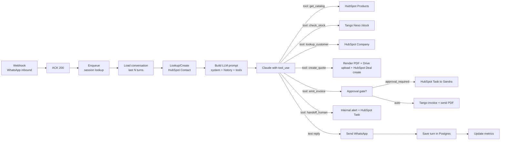

---
tags:
  - n8n
  - plan
  - blincer
  - nivel-3
client: blincer
flow: sales-bot-with-quotes
updated: 2026-05-29
status: blocked-by-oqs
---

# Plan — Bot de ventas + cotizaciones/facturas automáticas

← Volver a [[n8n/METHODOLOGY|Methodology]] · [[n8n/clients/blincer/flows/sales-bot-with-quotes/spec|Spec]] · [[n8n/clients/blincer/flows/sales-bot-with-quotes/research|Research]]

> ⚠️ **BLOQUEADO** — más OQs abiertas que cualquier otro flow (9 locales + 3 globales). Plan asume: Anthropic Claude (Haiku 4.5 default + escalación a Sonnet 4.6 para cotizaciones), WhatsApp Cloud API, Tango Nexo, catálogo en HubSpot Products + check stock just-in-time en Tango, política C (cotización auto + review de factura), Postgres para conversaciones. Re-validar después de cerrar OQs.

---

## Architecture

## Nodes

Esquema simplificado — el detalle por nodo se completa en `tasks.md` § Build.

| # | Node group | Type | Purpose | On error |
| --- | --- | --- | --- | --- |
| 1 | `Webhook inbound` | `webhook` | path `/blincer-sales-bot` | n/a |
| 2 | `ACK 200` | `respondToWebhook` | evitar reintentos del provider | n/a |
| 3 | `Session lookup` | `postgres` | leer últimos N turns por `from_phone` | retry 2× |
| 4 | `Contact lookup/create` | `hubspot` | search by phone, create if not exists | retry 3× |
| 5 | `Build prompt` | `function` | armar messages array con system+history+user_message | n/a |
| 6 | `Call LLM` | `httpRequest` o `langchain.agent` | Anthropic messages endpoint con `tools` definidos | retry 1×; on persist fail → mensaje "tuvimos un problema, te paso con un humano" + handoff |
| 7 | `Tool router` | `switch` | dispatch según `tool_use` devuelto | error branch genérico |
| 7a | `get_catalog` | `hubspot` | list products con filter | retry 3× |
| 7b | `check_stock` | `httpRequest` | GET stock by sku desde Tango | retry 1×; on fail → tool result `"stock_unknown"` (NO bloquea el bot) |
| 7c | `lookup_customer` | `hubspot` | search Company por CUIT/phone | retry 3× |
| 7d | `create_quote` | sub-workflow | render PDF + upload Drive + create HubSpot Deal stage "Cotización enviada" | rollback parcial si falla |
| 7e | `emit_invoice` | sub-workflow | check credit-limit (reusa lógica flow 1) + Tango POST `/comprobantes` + send PDF | si credit-limit dispara block → mensaje al cliente "tu solicitud requiere validación, te contactamos" + handoff |
| 7f | `handoff_human` | sub-workflow | create HubSpot Task + internal alert + reply al cliente con texto de transición | retry 3× |
| 8 | `Continue loop` | back to `Call LLM` | si tool_use, re-llamar al LLM con tool_result | max 5 iteraciones por mensaje (anti-loop) |
| 9 | `Send WhatsApp reply` | nodo WhatsApp | text final del LLM | retry 2× |
| 10 | `Save turn` | `postgres` | append user msg + assistant msg | retry 3× |
| 11 | `Update metrics` | `function` + `sheets/postgres` | counts + latencia + tokens consumidos | retry 3× |

### Sub-workflow: `create_quote`

| # | Node | Purpose |
| --- | --- | --- |
| 1 | Validate items | function — items deben venir del tool `get_catalog`; rechazar si LLM "inventa" un sku |
| 2 | Get stock final | httpRequest Tango por cada sku |
| 3 | Compute totals | function — precios + descuento + IVA |
| 4 | Render PDF | httpRequest Gotenberg con template DOCX |
| 5 | Upload Drive | googleDrive |
| 6 | Create HubSpot Deal | hubspot — stage "Cotización enviada", amount, items en custom prop |
| 7 | Return tool_result | con `quote_id`, `pdf_url`, `total`, `valid_until` |

### Sub-workflow: `emit_invoice`

| # | Node | Purpose |
| --- | --- | --- |
| 1 | Lookup Deal | hubspot — buscar Deal en stage "Cotización enviada" |
| 2 | Credit limit check | reusa lógica de flow 1 (call directo o duplicar) |
| 3 | If `approval_required` | crea HubSpot Task asignada a Sandra + responde "facturando, te confirmamos en breve" |
| 4 | Else / on approval | httpRequest Tango POST `/comprobantes` |
| 5 | Get invoice PDF | httpRequest Tango GET `/comprobantes/{id}/pdf` |
| 6 | Send PDF via WhatsApp | nodo WhatsApp media |
| 7 | Update Deal | stage "Ganado", custom prop `invoice_id` |
| 8 | Return tool_result | `invoice_id`, status |

## Cross-cutting decisions

### Idempotency

- **Dedup key:** `message_id` del provider WhatsApp (el provider incluye uno único por mensaje recibido).
- **Strategy:** lookup-then-insert en Postgres `processed_messages` con TTL 7 días.
- **Why:** providers WhatsApp pueden reentregar webhooks. Procesar dos veces el mismo mensaje generaría conversación corrupta y posibles cotizaciones duplicadas.

### Error handling

- **Retry policy:**
  - LLM: 1 reintento (no insistir — costo + posible loop).
  - Tango/HubSpot/Drive/Gotenberg: 3× backoff 2/4/8s.
  - WhatsApp send: 2× backoff 5/15s.
- **Dead-letter:** Postgres `bot_errors` con `{message_id, contact_id, step, error, payload}`. Cron horario alerta si > 5 errors / hora.
- **Alerting:**
  - Inmediata si LLM falla irrecuperablemente → handoff automático con mensaje de cortesía al cliente.
  - End-of-day summary a Guillermo con métricas (mensajes, cotizaciones, facturas, handoffs, costos LLM).

### Credentials & secrets

| Credential | n8n credential name | Stored in | Owner |
| --- | --- | --- | --- |
| HubSpot Private App | `hubspot-blincer-main` (reusa) | n8n | Innova |
| Tango Nexo | `tango-nexo-blincer` (reusa) | n8n | Innova |
| WhatsApp provider | `whatsapp-blincer` (reusa) | n8n | Innova |
| LLM (Anthropic) | `anthropic-blincer-bot` | n8n | Innova |
| Google Drive | `gdrive-blincer-quotes` | n8n | Innova |
| Gotenberg | endpoint + token | n8n env vars | Innova (self-hosted) |
| Postgres | `pg-innova-shared` | n8n | Innova |

### Observability

- **Logs por turn:** Postgres `conversaciones_bot` (siempre) + n8n executions (30 días).
- **Métricas:** Sheet `bot_metrics` con un row por día: `# mensajes`, `# conversaciones únicas`, `# cotizaciones`, `# facturas`, `# handoffs`, `tokens consumidos`, `USD gastados (LLM)`, `p95 latencia respuesta`.
- **Failure detection:** alerta a Guillermo si:
  - Tasa de handoff > 50% del volumen diario (algo está mal en el bot).
  - Costo LLM > 80% del budget mensual antes del día 25.
  - p95 latencia > 30s sostenido por > 1h.

### Testing

- **Test environment:** instancia WhatsApp sandbox + cliente de prueba (`+54 9 11 5555 6666 — TEST BOT`).
- **Test conversations:** scripts en `./test-payloads/`:
  - `convo_simple_quote.json` — pide cotización, confirma compra.
  - `convo_unknown_product.json` — pregunta por sku inexistente.
  - `convo_handoff_amount.json` — pide algo que supera umbral.
  - `convo_handoff_intent.json` — dice "quiero hablar con una persona".
  - `convo_pago_y_recompra.json` — confirma compra, vuelve a saludar (mismo session).
  - `convo_no_stock.json` — pide cantidad > stock.
- **LLM evals:** una suite de prompts con responses esperadas; assert no-hallucination (precio devuelto = precio en HubSpot).
- **Rollback:** si una cotización sale mal, anularla manualmente en HubSpot + notificar al cliente. Plan de "kill switch": flag `bot_enabled=false` en Sheet config que detiene el flow en el primer nodo.

## Risks & mitigations

| Risk | Likelihood | Impact | Mitigation |
| --- | --- | --- | --- |
| Alucinación de precio/stock | Alta sin guardrails | Crítico (pérdida de confianza + responsabilidad legal) | Tools obligatorios; system prompt explícito; validación post-LLM que detecta números no provenientes de tools |
| Costo LLM descontrolado | Alta | Alto | Budget cap; alerta 80%; modelo barato (Haiku) por default, Sonnet sólo en cotizaciones |
| Tango local sin API | Media | Alto | Degrade graceful: bot solo cotiza, factura manual; documentar en spec si OQ-G1=local |
| Latencia > 30s | Media | Medio | Streaming "te paso la cotización…"; paralelización; sub-workflow async |
| WhatsApp ban (volumen) | Baja-Media | Alto | Cloud API oficial (no Evolution para conversación de masas), opt-in cuando aplique |
| Handoff sin humano disponible (fines de semana) | Alta | Medio | Texto del bot: "vuelvo a contactarte el lunes 9am"; cola de HubSpot Tasks priorizada |
| Deal duplicado por conversaciones paralelas | Media | Medio | Dedup por `(contact_id, last_24h, stage=Cotización enviada)` |
| Cliente dice "ok" a una cotización vieja | Media | Medio | `valid_until` en la cotización + validar antes de emitir |
| Anti-loop del tool router falla → costo runaway | Baja | Alto | Max 5 iteraciones por message; hard stop con handoff |
| Provider reentrega webhook | Alta | Bajo (con idempotency) | Dedup por `message_id` en nodo 3 |

## Open dependencies before build

- [ ] Cerrar OQ-1 a OQ-9 del spec + OQ-G1, OQ-G2, OQ-G7.
- [ ] Decidir host de Gotenberg (Innova VPS o servicio externo tipo DocsAPI).
- [ ] Decidir Postgres disponible (Supabase? Postgres del VPS?). Si no hay → fallback Sheets para conversaciones (MVP frágil — flag de riesgo).
- [ ] Definir budget LLM mensual (USD/mes) y régimen de modelos (default + escalation).
- [ ] Diseñar system prompt + handoff_rules y validarlo con Guillermo.
- [ ] Diseñar template DOCX de cotización (branding Blincer).
- [ ] Aprobar templates WhatsApp con Meta si vamos Cloud API.
- [ ] Confirmar que el provider WhatsApp permite inbound bot + outbound dunning del flow 2 sin conflictos.
- [ ] Crear custom prop HubSpot Deal `quote_pdf_url`, `quote_items_json`, `valid_until`, `invoice_id`, `last_bot_interaction_at`.
- [ ] Setup Postgres schema (`conversaciones`, `processed_messages`, `bot_errors`).
