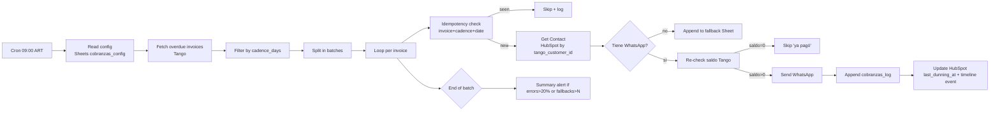

---
tags:
  - n8n
  - plan
  - blincer
  - nivel-3
client: blincer
flow: whatsapp-overdue-debt-reminder
updated: 2026-06-02
status: blocked-by-oqs
---

# Plan — Avisos automáticos de deuda vencida por WhatsApp

← Volver a [[n8n/METHODOLOGY|Methodology]] · [[n8n/clients/blincer/flows/whatsapp-overdue-debt-reminder/spec|Spec]] · [[n8n/clients/blincer/flows/whatsapp-overdue-debt-reminder/research|Research]]

> ⚠️ **BLOQUEADO** — pendiente OQ-1 (provider WhatsApp), OQ-2 (opt-in), OQ-3 (fallback), OQ-4 (Tango source), OQ-G1, OQ-G2, OQ-G7. Asumimos para diseñar: Cloud API oficial (más estable a volumen), fallback B (log a Sheet), Tango Nexo. Re-validar cuando se cierren las OQs.

> [!note] Build 2026-05-31 — skeleton importable
> `workflow.json` construido a mano. Nodos **disabled**: `Fetch overdue invoices (Tango)`, `Re-validate balance (Tango)` (OQ-4/OQ-G1) y `Send WhatsApp` (OQ-1/OQ-G2 + opt-in OQ-2). Gate duro: no habilitar `Send WhatsApp` sin opt-in documentado. `active: false`.

> [!success] Progreso 2026-06-02 — Sheets cableados
> Backing en el spreadsheet **Blincer - Cobranzas** (`12-VpWiZ2iw0QiHVast7-NOrAwASEAxOJuH4jer-Jb40`). Tabs creadas: `cobranzas_config`, `cobranzas_templates`, `cobranzas_log`, `cobranzas_fallback`, `idempotency_cobranzas` (columnas según el skeleton — `cobranzas_errors`/`cobranzas_metrics` y columnas extra del plan **aún no**). `REPLACE_SHEET_ID` reemplazado y credencial mapeada. `Idempotency lookup` quedó **disabled** (op `lookup` inexistente en googleSheets v4.5 + falta write-back — ver [[n8n/nodes/google-sheets|node note]]). (Las tabs `cobranzas_config`/`cobranzas_templates` se habían mezclado al crear y se corrigieron el 2026-06-02.)

> [!success] Progreso 2026-06-02 (dedup real + error workflow)
> **Dedup implementada** (patrón [[n8n/patterns/sheet-idempotency|Sheet-based idempotency]]): `Idempotency lookup` ahora es un `read` de `idempotency_cobranzas` (`alwaysOutputData`) → `Dedup filter` (Code) filtra por clave `(invoice_id, cadence_day)` → write-back `Idem row`→`Idem write` (fan-out desde `Log sent`, una fila por factura enviada). Asignado **Error Workflow** `T-000`. Validado estructuralmente; sin test de runtime (falta credencial HubSpot/WhatsApp + OQs).

> [!success] Progreso 2026-06-02 (HubSpot)
> Credencial **`hubspot-blincer-apptoken`** (App Token, id `A3JekIL652cjutl4`) enganchada a `Get Contact` y `Update HubSpot` (`authentication: appToken`). ⚠️ **El token provisto fue rechazado por HubSpot** ("expiresAt: 0" → truncado/revocado): pegar un Private App token válido en esa credencial desde la UI. Este flow no usa trigger de HubSpot (es cron), así que con el token vivo + provider WhatsApp + opt-in queda listo para testear la parte HubSpot.

---

## Architecture

## Nodes

| # | Node | Type | Purpose | Key params | On error |
| --- | --- | --- | --- | --- | --- |
| 1 | `Cron 09:00 ART` | `scheduleTrigger` | trigger diario | cron `0 9 * * *`, tz ART | n/a |
| 2 | `Read config` | `googleSheets` | leer `cadence_days`, `business_hours_window`, `excluded_customers` | sheetId, range `cobranzas_config!A:Z` | retry 3×; on fail → abort run + alerta |
| 3 | `Read templates` | `googleSheets` | leer texto template por cadence_day | range `cobranzas_templates!A:C` | retry 3×; on fail → abort |
| 4 | `Fetch overdue invoices` | `httpRequest` o connector local | GET facturas con `vencimiento < today AND saldo > 0` | URL, auth, query | retry 3× con backoff; on fail → abort + alerta crítica |
| 5 | `Compute cadence match` | `function` | para cada factura: `days_overdue = today - due_date`; mantener solo si `days_overdue ∈ cadence_days` | JS | n/a |
| 6 | `Exclude listed customers` | `function` | filter contra `excluded_customers` | JS | n/a |
| 7 | `Split in batches` | `splitInBatches` | throttle de envíos | batchSize=10, wait=2s | n/a |
| 8 | `Idempotency check` | `googleSheets` lookup | búsqueda en `cobranzas_log` por `(invoice_id, cadence_day, date(today))` | range full | retry 3× |
| 9 | `Get Contact` | `hubspot` | resolver contact por `tango_customer_id` (custom prop search) | resource=contact, operation=search | retry 3×; on fail → fallback row |
| 10 | `Has WhatsApp?` | `if` | property `phone` matchea formato E.164 | condition | route to fallback |
| 11 | `Re-validate balance` | `httpRequest` | GET saldo actual de la factura justo antes del envío | URL Tango | retry 1×; on fail → skip envío + log "no verificado" |
| 12 | `Compose message` | `function` | render template con variables | JS | n/a |
| 13 | `Send WhatsApp` | nodo según OQ-1 (`httpRequest` Evolution o nodo Cloud API) | enviar mensaje | phone, body | retry 2× con backoff; on fail → log error |
| 14 | `Log sent` | `googleSheets` append | row en `cobranzas_log` con status `sent` | range append | retry 3× |
| 15 | `Update HubSpot` | `hubspot` | set `last_dunning_at` + timeline event | resource, properties | retry 3×; on fail → log warning (no aborta el flow) |
| 16 | `Fallback append` | `googleSheets` append | row en `cobranzas_fallback` (no WhatsApp) | range append | retry 3× |
| 17 | `End-of-run summary` | `function` + alerta | calcular ratios; alertar si error_rate > 20% o fallbacks > N | JS + internal alert | retry 3× para la alerta |

## Cross-cutting decisions

### Idempotency

- **Dedup key:** `(invoice_id, cadence_day, date(YYYY-MM-DD))`.
- **Strategy:** lookup-then-insert en `cobranzas_log`. Una factura puede recibir varios mensajes a lo largo del tiempo (días 1, 7, 15…) pero **un solo mensaje por cadence_day por factura por día**.
- **Why:** la cadencia es por días específicos post-vencimiento; si el flow corre dos veces el mismo día (ej. retry manual), no debe duplicar envíos.

### Error handling

- **Retry policy:** 3× backoff 2s/4s/8s en I/O. Para `Send WhatsApp` solo 2× (no insistir contra el provider — riesgo de baneo).
- **Dead-letter:** Sheet `cobranzas_errors` con `{timestamp, invoice_id, node, error, payload}`.
- **Alerting:**
  - Inmediata: `Fetch overdue invoices` falla → abort + alerta crítica.
  - End-of-run: si error_rate > 20% o si `cobranzas_fallback` recibe > 10 rows nuevas en una corrida → alerta a Sandra con resumen.

### Credentials & secrets

| Credential | n8n credential name | Stored in | Owner |
| --- | --- | --- | --- |
| HubSpot Private App | `hubspot-blincer-main` (a crear — hoy placeholder) | n8n | Innova |
| Tango | `tango-nexo-blincer` o local (a crear) | n8n | Innova |
| Google Sheets | **`Google Sheets account`** (`NNpCFCk3F2rhlxUk`, reusa la de BLINCER-T0xx) | n8n | Innova |
| WhatsApp provider | `whatsapp-blincer` (a crear) | n8n | Innova / Sandra |
| Canal alerta interno | `internal-alert-blincer` (a crear) | n8n | Innova |

### Observability

- Cada execution queda en n8n executions list, retención 30 días.
- Métricas a trackear desde día 1: `# facturas evaluadas`, `# en cadencia`, `# enviados`, `# fallback (no WA)`, `# skip 'ya pagó'`, `# errores`, `p95 send latency`.
- Dashboard sugerido: Sheet `cobranzas_metrics` con un row por corrida que agrega los counts (lo arma el último nodo).

### Testing

- **Test environment:** sandbox Tango (si existe) o cliente sintético `__TEST_BLINCER_DEBT__` con facturas vencidas dummy.
- **WhatsApp:** sandbox del provider (Evolution permite instance separada; Cloud API tiene test phone number).
- **Test cases:**
  - Factura con `days_overdue = 7` y template configurado → mensaje sent.
  - Factura con `days_overdue = 5` (no en cadence) → ignorada.
  - Cliente sin WhatsApp → fallback Sheet, sin envío.
  - Cliente en `excluded_customers` → ignorado.
  - Cliente paga entre fetch y send (saldo = 0 en re-validate) → skip "ya pagó".
  - Tango down → abort + alerta.
- **Rollback:** si una corrida produce mensajes incorrectos, alertar a clientes afectados (manual) y desactivar workflow hasta fix.

## Risks & mitigations

| Risk | Likelihood | Impact | Mitigation |
| --- | --- | --- | --- |
| Baneo WhatsApp por falta de opt-in | Alta si Evolution sin opt-in claro | Alto — pérdida del canal | Confirmar opt-in en OQ-2 antes de live; arrancar con clientes que firmaron consentimiento |
| Cloud API template no aprobado | Media | Medio — mensajes no salen | Submission + aprobación de templates como pre-build task |
| Tango no entrega facturas en formato esperado | Media | Alto | Schema validation en nodo 4; abort + alerta si mismatch |
| Cliente paga, recibe recordatorio igual | Media | Bajo (reputacional) | Re-validate saldo en nodo 11 |
| Timezone n8n distinta de ART | Baja | Alto (envío fuera de banda) | Validar tz en setup; assert en primer run |
| Sandra edita template y rompe variables (`{{nombre}}` mal escrito) | Media | Medio | Validar templates en nodo 3 antes del loop; abort + alerta si placeholder inválido |
| Volumen excede rate-limit del provider | Baja inicial | Medio | `splitInBatches` con throttle 2s; subir batchSize gradualmente |

## Open dependencies before build

- [ ] Resolver OQ-1 a OQ-7 del spec + OQ-G1, OQ-G2, OQ-G7.
- [ ] Confirmar opt-in escrito de los clientes (legal y operativo).
- [ ] Si Cloud API: aprobar templates en Meta (1–2 días lead time).
- [ ] Crear Sheets: `cobranzas_config`, `cobranzas_templates`, `cobranzas_log`, `cobranzas_fallback`, `cobranzas_errors`, `cobranzas_metrics`.
- [ ] Crear custom property HubSpot Company `last_dunning_at` (datetime).
- [ ] Crear timeline event HubSpot "Recordatorio cobranza" (CRM Cards API).
- [ ] Confirmar que el n8n del proyecto está en tz `America/Argentina/Buenos_Aires`.
