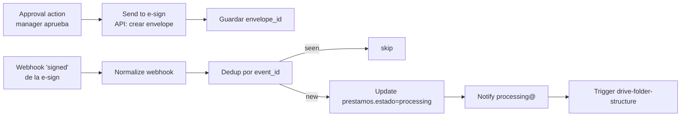

---
tags:
  - n8n
  - plan
  - gpt-landings
  - nivel-3
client: gpt-landings
flow: approval-and-esign
updated: 2026-06-10
status: blocked-by-oqs
---

# Plan — C · Approval & e-sign

← Volver a [[n8n/METHODOLOGY|Methodology]] · [[n8n/clients/gpt-landings/flows/approval-and-esign/spec|Spec]] · [[n8n/clients/gpt-landings/flows/approval-and-esign/research|Research]]

> ⚠️ **BLOQUEADO** — no ejecutar hasta resolver OQ-C-1 (DocuSign vs PandaDoc, def #3), OQ-C-2 (quién aprueba/canal, def #7), OQ-C-3 (event_id) + B y M0. Arquitectura propuesta asumiendo PandaDoc/DocuSign con webhook que trae `event_id`.

---

## Architecture

## Nodes

| # | Node | Type | Purpose | Key params | On error |
| --- | --- | --- | --- | --- | --- |
| 1 | `Approval intake` | webhook/manual | recibir aprobación del manager | canal OQ-C-2 | n/a |
| 2 | `Send to e-sign` | `httpRequest` | crear envelope con el PDF de B | endpoint, auth, signer | retry 3×; on fail → alerta |
| 3 | `Store envelope` | `postgres` | guardar `envelope_id` + `approver` | update | retry 3× |
| 4 | `Webhook signed` | `webhook` | recibir "envelope completed" | path `gptlandings-esign` | n/a |
| 5 | `Normalize webhook` | `code` | aislar shape del provider → campos canónicos | JS defensivo | — |
| 6 | `Dedup event` | `code`+store | descartar reentregas por `event_id` | sheet/DB | — |
| 7 | `Set processing` | `postgres` | `prestamos.estado='processing'` + `signed_at` | update por loan | retry 3× |
| 8 | `Notify processing@` | email/alert | aviso al equipo | canal OQ-0.4 | retry 3× |
| 9 | `Trigger G` | event | disparar folder structure | — | log |

## Cross-cutting decisions

### Idempotency
- Dedup key: `event_id` del webhook de la e-sign (fallback `(loan_id, 'signed')` si no hay event_id — OQ-C-3).
- Strategy: lookup-then-insert (patrón `sheet-idempotency`).
- Why: la e-sign reentrega webhooks; no pasar a `processing` ni notificar dos veces.

### Error handling
- Retry policy: 3× backoff 2/4/8s en e-sign/DB/alertas.
- Dead-letter: `errors` con `{loan_id, event_id, node, error}`.
- Alerting: si `Send to e-sign` falla → alerta (el término no salió a firma); si `Set processing` falla tras firma → alerta crítica (estado inconsistente).

### Credentials & secrets

| Credential | n8n credential name | Stored in | Owner |
| --- | --- | --- | --- |
| e-sign (DocuSign/PandaDoc) | `gptlandings-esign` (a crear) | n8n credentials | Innova |
| DB | `gptlandings-db` | n8n credentials | Innova |
| Canal interno | `gptlandings-internal-alert` | n8n credentials | Innova (OQ-0.4) |

### Observability
- Logs: envío a firma (envelope_id) + recepción del firmado (event_id) + cambio de estado.
- Métricas: `# enviados a firma`, `# firmados`, tiempo medio firma, `# reentregas deduplicadas`.

### Testing
- Test payloads: `esign_send.json`, `esign_signed_webhook.json`, `esign_duplicate_webhook.json` (reentrega).
- Environment: sandbox del provider de e-sign (DocuSign/PandaDoc tienen sandbox).
- Rollback: revertir `estado` a previo si el cambio fue erróneo (script); no se puede "des-firmar".

## Risks & mitigations

| Risk | Likelihood | Impact | Mitigation |
| --- | --- | --- | --- |
| Provider e-sign sin decidir | Alta | Alto | Bloqueante OQ-C-1; sandbox apenas se decida |
| Webhook sin `event_id` | Media | Medio | Fallback dedup `(loan_id, status)`; documentar semántica |
| Estado inconsistente (firmado pero no `processing`) | Baja | Alto | Alerta crítica + retry; reconciliación manual |
| Canal de aprobación sin definir | Media | Medio | OQ-C-2; default email mientras tanto |

## Open dependencies before build

- [ ] Resolver OQ-C-1, OQ-C-2, OQ-C-3.
- [ ] B entregando el PDF + `valid_until`.
- [ ] M0: DB + canal de alerta interno.
- [ ] Crear el webhook del lado de la e-sign apuntando a `/webhook/gptlandings-esign`.
