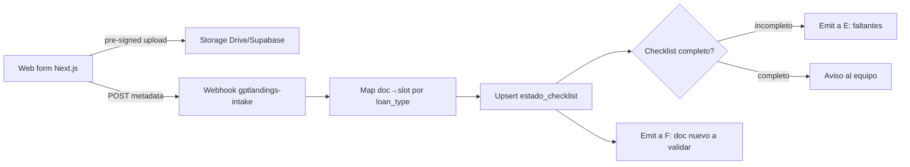

---
tags:
  - n8n
  - plan
  - gpt-landings
  - nivel-3
client: gpt-landings
flow: document-intake-form
updated: 2026-06-10
status: blocked-by-oqs
---

# Plan — D · Document intake (backend)

← Volver a [[n8n/METHODOLOGY|Methodology]] · [[n8n/clients/gpt-landings/flows/document-intake-form/spec|Spec]] · [[n8n/clients/gpt-landings/flows/document-intake-form/research|Research]]

> ⚠️ **BLOQUEADO** — no ejecutar hasta resolver OQ-D-1 (lista de docs por tipo, def #4), OQ-D-3 (storage), OQ-D-4 (front/auth) + M0. Arquitectura propuesta asumiendo uploads vía pre-signed URL a storage (no pasar archivos pesados por n8n) + estado en Postgres.

---

## Architecture

## Nodes

| # | Node | Type | Purpose | Key params | On error |
| --- | --- | --- | --- | --- | --- |
| 1 | `Webhook intake` | `webhook` | recibir metadata del upload | path `gptlandings-intake` | n/a |
| 2 | `Load checklist def` | `postgres` | slots requeridos por `loan_type` (def #4) | select | retry 3× |
| 3 | `Map doc→slot` | `code` | asociar archivo a slot; validar slot existe | JS | branch "slot inválido" |
| 4 | `Persist file ref` | `googleDrive`/Supabase | guardar/registrar el archivo (idealmente vía pre-signed URL) | folder/bucket | retry 3× |
| 5 | `Upsert estado_checklist` | `postgres` | `status` del slot → `received` | onConflict (loan_id, slot) | retry 3× |
| 6 | `Compute completeness` | `code` | ¿faltan slots? | JS | — |
| 7 | `Emit to E` | event | estado del checklist (faltantes) | — | log |
| 8 | `Emit to F` | event | doc nuevo a validar | — | log |
| 9 | `Notify team if complete` | alert | aviso al equipo | canal OQ-0.4 | retry 3× |

## Cross-cutting decisions

### Idempotency
- Dedup key: `(loan_id, doc_slot)`.
- Strategy: upsert `ON CONFLICT (loan_id, slot)` en `estado_checklist`.
- Why: re-subir el mismo slot actualiza el archivo/estado, no crea filas duplicadas.

### Error handling
- Retry policy: 3× backoff en storage/DB.
- Dead-letter: `errors` con `{loan_id, slot, node, error}`.
- Alerting: slot inválido o fallo de persistencia → aviso interno.

### Credentials & secrets

| Credential | n8n credential name | Stored in | Owner |
| --- | --- | --- | --- |
| Drive / Supabase Storage | `gptlandings-drive` / `gptlandings-db` | n8n credentials | Innova |
| DB | `gptlandings-db` | n8n credentials | Innova |

### Observability
- Logs: por upload — loan, slot, tamaño, resultado.
- Métricas: `# uploads`, `# checklists completados`, `% completitud media`, `# slots inválidos`.

### Testing
- Test payloads: `intake_single_doc.json`, `intake_complete_set.json`, `intake_resubmit_same_slot.json`, `intake_invalid_slot.json`.
- Environment: storage de prueba + DB dev (M0).
- Rollback: re-upsert; borrar archivo de storage si quedó huérfano.

## Risks & mitigations

| Risk | Likelihood | Impact | Mitigation |
| --- | --- | --- | --- |
| Archivos pesados saturan n8n | Media | Medio | Pre-signed URL directo a storage; n8n solo recibe metadata |
| Lista de docs sin cerrar (def #4) | Alta inicial | Alto | Bloqueante OQ-D-1; arrancar con un loan_type |
| Auth del borrower débil | Media | Alto | Definir OQ-D-4 (link único firmado por préstamo) |
| Doc subido al slot equivocado | Media | Bajo | Validación + permitir re-mapear |

## Open dependencies before build

- [ ] Resolver OQ-D-1, OQ-D-3, OQ-D-4 (+ OQ-D-2 si la lista varía).
- [ ] M0: storage + DB + tablas de checklist.
- [ ] Coordinar contrato con el front-end (web) — payload y pre-signed URL.
