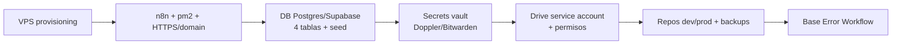

---
tags:
  - n8n
  - plan
  - gpt-landings
  - nivel-3
client: gpt-landings
flow: m0-infra-setup
updated: 2026-06-10
status: blocked-by-oqs
---

# Plan — M0 · Infrastructure base

← Volver a [[n8n/METHODOLOGY|Methodology]] · [[n8n/clients/gpt-landings/flows/m0-infra-setup/spec|Spec]] · [[n8n/clients/gpt-landings/flows/m0-infra-setup/research|Research]]

> ⚠️ **BLOQUEADO** — no ejecutar hasta resolver OQ-M0-1..4 + transversales (acceso VPS 🚦, Google Workspace 🚦). Arquitectura propuesta asumiendo VPS Linux con acceso root + Supabase managed. Re-validar al cerrar OQs.

---

## Architecture

## Nodes / components

| # | Component | Type | Purpose | Key params | On error |
| --- | --- | --- | --- | --- | --- |
| 1 | VPS base | infra | OS hardening, firewall, usuario de servicio | SSH keys, ufw | manual |
| 2 | n8n + pm2 | infra | n8n bajo pm2 con HTTPS (reverse proxy) | dominio, TLS, `pm2 startup`/`save` | restart-on-boot |
| 3 | DB schema | sql | tablas `prestamos`, `capital_partners`, `documentos_requeridos`, `estado_checklist` | migración versionada | rollback de migración |
| 4 | Secrets vault | infra | Doppler/Bitwarden | proyecto + service token | — |
| 5 | Drive access | gcp | service account / OAuth + permisos de carpeta | scopes drive.file | — |
| 6 | Repos + backups | infra | repos dev/prod, dump programado de DB | cron de backup | alerta si falla backup |
| 7 | Base Error Workflow | n8n | `errorTrigger` → alerta al canal interno | default error workflow | — |

## Cross-cutting decisions

### Idempotency
- Dedup key: n/a (setup one-shot).
- Strategy: scripts idempotentes (crear-si-no-existe) para tablas y carpetas.
- Why: re-correr el setup no debe duplicar schema ni borrar datos.

### Error handling
- Retry policy: n/a (manual).
- Dead-letter: n/a.
- Alerting: el Error Workflow base notifica al canal interno (OQ-0.4) ante fallo de cualquier flow futuro.

### Credentials & secrets

| Credential | n8n credential name | Stored in | Owner |
| --- | --- | --- | --- |
| Drive (service account) | `gptlandings-drive` (a crear) | n8n credentials | Innova |
| DB connection | `gptlandings-db` (a crear) | n8n credentials | Innova |
| (otras: e-sign, WhatsApp, Claude) | `gptlandings-*` | n8n credentials | Innova (en sus módulos) |

No secrets inline. Lo no-n8n va al vault (Doppler/Bitwarden, OQ-M0-1).

### Observability
- Logs: n8n executions (retención 30 días) + logs de pm2/servidor.
- Run history: n8n default.
- Failure detection: Error Workflow base + alerta de backup fallido.

### Testing
- Test payload(s): n/a.
- Environment: el propio VPS (dev/prod separados a nivel repo/branch + DB schema).
- Rollback: snapshot del VPS / dump de DB antes de cada cambio estructural.

## Risks & mitigations

| Risk | Likelihood | Impact | Mitigation |
| --- | --- | --- | --- |
| Sin acceso VPS/Workspace a tiempo | Media | Alto | Pedir accesos como prioridad #1 (discovery §0) |
| Supabase managed vs Postgres en VPS mal elegido | Media | Medio | Decidir en OQ-M0-2 según volumen y presupuesto |
| Backups no verificados | Baja | Alto | DoD incluye restore dry-run obligatorio |
| Dominio/DNS no disponible | Media | Medio | Confirmar en OQ-M0 (1.3); fallback subdominio de Innova temporal |

## Open dependencies before build

- [ ] Resolver OQ-M0-1..4 del spec + transversales (acceso VPS, Google Workspace).
- [ ] Confirmar volumen para dimensionar (def #8).
- [ ] Elegir vault de secrets y DB host.
