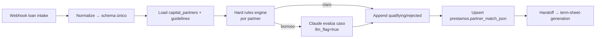

---
tags:
  - n8n
  - plan
  - gpt-landings
  - nivel-3
client: gpt-landings
flow: partner-matching-engine
updated: 2026-06-10
status: blocked-by-oqs
---

# Plan — A · Capital-partner matching engine

← Volver a [[n8n/METHODOLOGY|Methodology]] · [[n8n/clients/gpt-landings/flows/partner-matching-engine/spec|Spec]] · [[n8n/clients/gpt-landings/flows/partner-matching-engine/research|Research]]

> ⚠️ **BLOQUEADO** — no ejecutar hasta resolver OQ-A-1..5 (sobre todo formato/cantidad de guidelines, def #1) + M0. Arquitectura propuesta asumiendo guidelines modelables como reglas en DB y Claude (Haiku por default) para borrosos. Re-validar al cerrar OQs.

---

## Architecture

## Nodes

| # | Node | Type | Purpose | Key params | On error |
| --- | --- | --- | --- | --- | --- |
| 1 | `Webhook loan intake` | `webhook` | recibir préstamo | path `gptlandings-loan-intake` | n/a |
| 2 | `Normalize` | `code` | mapear `raw_format` a schema único | JS defensivo | branch error "formato no soportado" |
| 3 | `Load partners` | `postgres` | leer `capital_partners` activos + guidelines | select | retry 3× |
| 4 | `Hard rules` | `code` | evaluar reglas duras por partner (LTV, condado, monto, tipo) | JS, reglas como datos | n/a |
| 5 | `Borderline?` | `if` | si una regla queda indeterminada | condition | — |
| 6 | `Claude evaluate` | `httpRequest`/langchain | resolver caso borroso, salida estructurada | model Haiku, tools/JSON | retry 1×; si falla → marcar `needs_human` |
| 7 | `Assemble result` | `code` | armar `qualifying_partners[]` con rationale + flags | JS | n/a |
| 8 | `Upsert match` | `postgres` | `prestamos.partner_match_json` upsert por `loan_id` | onConflict loan_id | retry 3× |
| 9 | `Handoff to B` | `executeWorkflow`/event | disparar term-sheet-generation | — | log |

## Cross-cutting decisions

### Idempotency
- Dedup key: `loan_id`.
- Strategy: upsert por `loan_id` en `prestamos.partner_match_json` (re-evaluar pisa el resultado anterior, no duplica).
- Why: una misma carga puede reintentarse; el resultado es función pura del input + guidelines.

### Error handling
- Retry policy: 3× backoff 2/4/8s en DB; 1× en Claude (no insistir, costo).
- Dead-letter: tabla/sheet `errors` con `{loan_id, node, error, payload}`.
- Alerting: si `Normalize` no reconoce formato o Claude falla → flag `needs_human` + aviso al canal interno (OQ-0.4).

### Credentials & secrets

| Credential | n8n credential name | Stored in | Owner |
| --- | --- | --- | --- |
| DB | `gptlandings-db` | n8n credentials | Innova |
| Claude API | `gptlandings-claude` | n8n credentials | Innova |

No secrets inline.

### Observability
- Logs: cada evaluación con decisión + qué reglas dispararon + si usó LLM.
- Métricas: `# préstamos`, `# partners evaluados`, `# hard pass`, `# borrosos (LLM)`, `# needs_human`, tokens/USD Claude.

### Testing
- Test payloads: `loan_clean_pass.json` (hard pass claro), `loan_borderline.json` (dispara LLM), `loan_no_match.json` (no califica para nadie), `loan_bad_format.json` (error de normalización).
- Environment: DB dev de M0 con seed de `capital_partners` dummy.
- Rollback: re-upsert; sin efectos externos irreversibles (A no firma ni envía nada).

## Risks & mitigations

| Risk | Likelihood | Impact | Mitigation |
| --- | --- | --- | --- |
| Guidelines informales/dispersas | Alta | Alto | Relevar en def #1 antes de modelar; arrancar con 1-2 partners |
| Claude alucina un "hard pass" | Media | Alto | Reglas duras deciden; LLM solo marca `llm_flag` + explica; nunca decide solo |
| Schema del préstamo incompleto | Media | Medio | Definir schema canónico (OQ-A-4); validar input |
| Costo Claude alto si muchos borrosos | Baja | Medio | Cap mensual (OQ-A-5); Haiku por default |

## Open dependencies before build

- [ ] Resolver OQ-A-1..5 + M0.
- [ ] Obtener guidelines reales de al menos 1-2 partners para modelar.
- [ ] Definir schema canónico del préstamo + contrato JSON hacia B.
