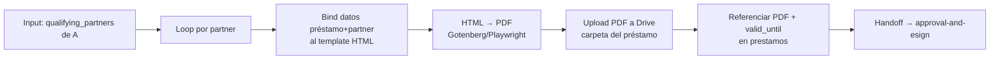

---
tags:
  - n8n
  - plan
  - gpt-landings
  - nivel-3
client: gpt-landings
flow: term-sheet-generation
updated: 2026-06-10
status: blocked-by-oqs
---

# Plan — B · Term-sheet generation

← Volver a [[n8n/METHODOLOGY|Methodology]] · [[n8n/clients/gpt-landings/flows/term-sheet-generation/spec|Spec]] · [[n8n/clients/gpt-landings/flows/term-sheet-generation/research|Research]]

> ⚠️ **BLOQUEADO** — no ejecutar hasta resolver OQ-B-1 (template + campos, def #2) y OQ-B-2 (HTML→PDF propio vs e-sign, depende de OQ-C-1) + A y M0. Arquitectura propuesta asumiendo render HTML→PDF con Gotenberg/Playwright self-hosted + upload a Drive.

---

## Architecture

## Nodes

| # | Node | Type | Purpose | Key params | On error |
| --- | --- | --- | --- | --- | --- |
| 1 | `Receive from A` | trigger/exec | recibir `loan_id` + `qualifying_partners` + defaults | — | n/a |
| 2 | `Split per partner` | `splitInBatches` | un term sheet por partner | batchSize 1 | — |
| 3 | `Validate items` | `code` | rechazar partner que no venga del JSON de A (no inventar) | JS | skip + log |
| 4 | `Bind template` | `code` | render HTML con datos préstamo+partner + tasa/monto | template engine, locale USD | — |
| 5 | `HTML→PDF` | `httpRequest` (Gotenberg) | generar PDF | endpoint + token | retry 3× |
| 6 | `Upload Drive` | `googleDrive` | subir a carpeta del préstamo | folderId, binary | retry 3× |
| 7 | `Reference in DB` | `postgres` | guardar `pdf_url` + `valid_until` | update por loan+partner | retry 3× |
| 8 | `Handoff to C` | event | marcar listo para aprobación | — | log |

## Cross-cutting decisions

### Idempotency
- Dedup key: `(loan_id, partner_id, template_version)`.
- Strategy: nombre de archivo determinista en Drive + update (no append) en DB → re-render pisa, no duplica.
- Why: re-generar un term sheet (corrección de tasa) no debe dejar PDFs huérfanos duplicados.

### Error handling
- Retry policy: 3× backoff en Gotenberg/Drive/DB.
- Dead-letter: log `errors` con `{loan_id, partner_id, node, error}`.
- Alerting: si falla el render para un partner → aviso interno, no corta el resto del loop.

### Credentials & secrets

| Credential | n8n credential name | Stored in | Owner |
| --- | --- | --- | --- |
| Google Drive | `gptlandings-drive` | n8n credentials | Innova |
| DB | `gptlandings-db` | n8n credentials | Innova |
| Gotenberg | endpoint + token | n8n env vars | Innova (self-hosted) |

### Observability
- Logs: por term sheet — partner, tamaño del PDF, duración del render.
- Métricas: `# term sheets generados`, `# fallos de render`, p95 latencia.

### Testing
- Test payloads: `tsheet_single_partner.json`, `tsheet_multi_partner.json`, `tsheet_edit_rate.json` (re-render con tasa editada).
- Environment: Drive de prueba + Gotenberg de M0.
- Rollback: borrar el PDF de Drive + revertir la referencia en DB (script).

## Risks & mitigations

| Risk | Likelihood | Impact | Mitigation |
| --- | --- | --- | --- |
| Sin template/ejemplo real (def #2) | Alta inicial | Alto | Bloqueante OQ-B-1; pedir ejemplo con datos dummy |
| Decisión HTML→PDF vs e-sign sin cerrar | Media | Medio | Diseñar render propio; si C usa template nativo de e-sign, B se simplifica |
| Host de Gotenberg/Playwright no provisto | Media | Medio | Definir en M0 (VPS propio o servicio externo) |
| Datos sensibles en el PDF en Drive | Media | Medio | Permisos de carpeta acotados (G) + service account |

## Open dependencies before build

- [ ] Resolver OQ-B-1 (template + campos + ejemplo) y OQ-B-2 (render).
- [ ] A entregando el JSON `qualifying_partners` estable.
- [ ] M0: Drive + host de render disponibles.
