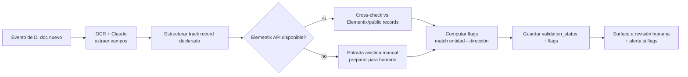

---
tags:
  - n8n
  - plan
  - gpt-landings
  - nivel-3
client: gpt-landings
flow: track-record-validation
updated: 2026-06-10
status: blocked-by-oqs
---

# Plan — F · Track-record validation & cross-check

← Volver a [[n8n/METHODOLOGY|Methodology]] · [[n8n/clients/gpt-landings/flows/track-record-validation/spec|Spec]] · [[n8n/clients/gpt-landings/flows/track-record-validation/research|Research]]

> ⚠️ **NO EJECUTAR — CARVE-OUT CONDICIONAL.** Bloqueado por **OQ-F-1 (¿Elementix expone API?)** — discovery def #6, la más crítica. La arquitectura de abajo es **propuesta condicional**: re-evaluar viabilidad y precio antes de comprometer alcance. Si Elementix es solo UI, el módulo puede degradarse a "entrada asistida manual" o quedar **fuera de alcance**.

---

## Architecture (propuesta condicional)

## Nodes

| # | Node | Type | Purpose | Key params | On error |
| --- | --- | --- | --- | --- | --- |
| 1 | `On doc event` | trigger/exec | recibir doc de D | — | n/a |
| 2 | `OCR + extract` | OCR/Claude | extraer campos del doc | model | retry 1×; on fail → `needs_human` |
| 3 | `Structure declared` | `code` | normalizar track record declarado | JS | — |
| 4 | `Elementix available?` | `if` | rama API vs UI/manual (OQ-F-1) | flag config | — |
| 5a | `Cross-check (API)` | `httpRequest` | consultar Elementix/public records | endpoint, auth | si fuente caída → flag "no verificado" (fail-safe), NO afirmar match |
| 5b | `Manual-assist` | `code`/task | preparar comparación para humano | — | — |
| 6 | `Compute flags` | `code` | criterios de match (OQ-F-4) | JS | — |
| 7 | `Save validation` | `postgres` | `validation_status` + `flags[]` + `extracted_fields` | update por doc | retry 3× |
| 8 | `Surface to human` | alert/task | resumen + flags al equipo | canal OQ-0.4 | retry 3× |

## Cross-cutting decisions

### Idempotency
- Dedup key: `(loan_id, doc_id)`.
- Strategy: update por doc (re-validar pisa); no re-procesar el mismo doc dos veces salvo cambio.
- Why: cada doc se valida una vez; reintentos no duplican flags.

### Error handling
- Retry policy: 1× en OCR/LLM (costo); 3× en DB/alertas; el cross-check externo con fail-safe (fuente caída → "no verificado", nunca "match").
- Dead-letter: `validation_errors`.
- Alerting: flags al equipo; si OCR/extracción falla → `needs_human`.

### Credentials & secrets

| Credential | n8n credential name | Stored in | Owner |
| --- | --- | --- | --- |
| Claude / OCR | `gptlandings-claude` | n8n credentials | Innova |
| Elementix / public records | `gptlandings-elementix` (si hay API — OQ-F-1) | n8n credentials | Innova |
| DB | `gptlandings-db` | n8n credentials | Innova |

### Observability
- Logs: por doc — campos extraídos, fuente consultada, flags, resultado.
- Métricas: `# docs validados`, `# flags`, `# no verificados (fuente caída)`, costo OCR/Claude.

### Testing
- Test payloads: `valid_match.json`, `valid_mismatch.json` (flag), `source_down.json` (fail-safe), `ocr_fail.json` (needs_human).
- Environment: sandbox/datos sintéticos; **no** tocar fuentes reales hasta confirmar OQ-F-1.
- Rollback: re-validar; sin efectos externos irreversibles (F solo prepara para humano).

## Risks & mitigations

| Risk | Likelihood | Impact | Mitigation |
| --- | --- | --- | --- |
| **Elementix solo UI (sin API)** | Media-Alta | **Define viabilidad** | Bloqueante OQ-F-1; carve-out; degradar a manual o descartar |
| Scraping frágil / baneo (si UI) | Media | Alto | Entrada asistida manual como alternativa |
| Falsos positivos/negativos en el match | Media | Alto | Validación humana final obligatoria; criterios claros (OQ-F-4) |
| Costo OCR+Claude por volumen | Media | Medio | Cap (OQ-F-3); modelo eficiente |
| Afirmar match con fuente caída | Baja | Alto | Fail-safe "no verificado" (lección de credit-limit/auditoría-facturas) |

## Open dependencies before build

- [ ] **CONFIRMAR OQ-F-1 (Elementix API vs solo UI)** — sin esto no hay build real.
- [ ] OQ-F-2 (scraping vs manual si UI), OQ-F-3 (budget), OQ-F-4 (criterios de match).
- [ ] Decisión comercial: F entra como adicional cotizado o queda fuera de alcance.
- [ ] D entregando docs + M0 (DB + Claude).
