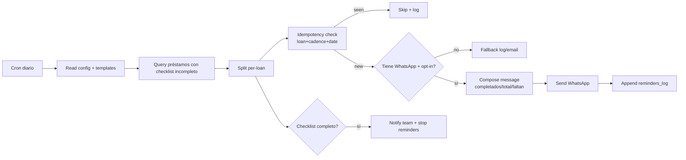

---
tags:
  - n8n
  - plan
  - gpt-landings
  - nivel-3
client: gpt-landings
flow: whatsapp-doc-reminder
updated: 2026-06-10
status: blocked-by-oqs
---

# Plan — E · WhatsApp document reminders

← Volver a [[n8n/METHODOLOGY|Methodology]] · [[n8n/clients/gpt-landings/flows/whatsapp-doc-reminder/spec|Spec]] · [[n8n/clients/gpt-landings/flows/whatsapp-doc-reminder/research|Research]]

> ⚠️ **BLOQUEADO** — no ejecutar hasta resolver OQ-E-1 (provider), OQ-E-2 (templates Meta), OQ-E-3 (opt-in) + D y M0. Gate duro: **no habilitar el envío sin opt-in documentado**. Arquitectura calcada de `whatsapp-overdue-debt-reminder` (Blincer).

---

## Architecture

## Nodes

| # | Node | Type | Purpose | Key params | On error |
| --- | --- | --- | --- | --- | --- |
| 1 | `Cron` | `scheduleTrigger` | trigger diario | cron, tz (South Florida/ET) | n/a |
| 2 | `Read config` | `googleSheets`/`postgres` | `cadence_days`, ventana, exclusiones | range | retry 3×; on fail → abort + alerta |
| 3 | `Read templates` | `googleSheets`/`postgres` | template por cadence_day | range | retry 3× |
| 4 | `Query incomplete` | `postgres` | préstamos con `pending > 0` en `estado_checklist` | query | retry 3× |
| 5 | `Compute cadence` | `code` | días desde última y match de cadencia | JS | — |
| 6 | `Split per-loan` | `splitInBatches` | throttle | batchSize 10, wait 2s | — |
| 7 | `Idempotency check` | `code`+store | `(loan_id, cadence_day, date)` | sheet/DB | retry 3× |
| 8 | `Has WA + opt-in?` | `if` | número E.164 + `opt_in=true` | condition | route fallback |
| 9 | `Compose` | `code` | render template + variables | JS | — |
| 10 | `Send WhatsApp` | nodo según OQ-E-1 | enviar | template/phone | retry 2× (no insistir) |
| 11 | `Log sent` | append | `reminders_log` | append | retry 3× (write-back idempotencia) |
| 12 | `Fallback` | append | log/email si no WA | append | retry 3× |
| 13 | `On complete` | `if`+alert | si checklist completo → aviso equipo + stop | — | retry 3× |

## Cross-cutting decisions

### Idempotency
- Dedup key: `(loan_id, cadence_day, date(YYYY-MM-DD))`.
- Strategy: lookup-then-insert; write-back desde `Log sent` (patrón `sheet-idempotency`).
- Why: si el cron corre dos veces el mismo día, no duplicar el recordatorio.

### Error handling
- Retry policy: 3× I/O; 2× en el send (no insistir → riesgo baneo).
- Dead-letter: `reminders_errors`.
- Alerting: `Query incomplete` falla → abort + alerta; error_rate alto → resumen al equipo.

### Credentials & secrets

| Credential | n8n credential name | Stored in | Owner |
| --- | --- | --- | --- |
| WhatsApp provider | `gptlandings-whatsapp` (a crear) | n8n credentials | Innova |
| DB | `gptlandings-db` | n8n credentials | Innova |
| Canal interno | `gptlandings-internal-alert` | n8n credentials | Innova |

### Observability
- Logs: por préstamo — enviado/skip/fallback, faltantes.
- Métricas: `# incompletos`, `# enviados`, `# fallback`, `# completados hoy`, p95 latencia.

### Testing
- Test payloads: `reminder_incomplete.json`, `reminder_complete_today.json`, `reminder_no_optin.json`, `reminder_rerun_same_day.json`.
- Environment: sandbox del provider WhatsApp + DB dev.
- Rollback: desactivar el workflow; los mensajes ya enviados no se revierten (cuidado: gate de opt-in).

## Risks & mitigations

| Risk | Likelihood | Impact | Mitigation |
| --- | --- | --- | --- |
| Templates HSM de Meta sin aprobar | Alta | Alto | Submission temprana (def #5); arrancar verificación YA |
| Baneo WhatsApp por falta de opt-in | Alta si Evolution | Alto | Gate de opt-in obligatorio antes de encender |
| Timezone equivocada (ART vs ET) | Media | Medio | Confirmar tz South Florida/ET en setup |
| Borrower paga/completa entre query y envío | Baja | Bajo | Re-chequear completitud justo antes del send |

## Open dependencies before build

- [ ] Resolver OQ-E-1..5 + D entregando `estado_checklist`.
- [ ] Opt-in documentado del borrower.
- [ ] Si Cloud API: aprobar templates en Meta (lead time).
- [ ] Confirmar tz de la instancia n8n (South Florida / ET).
