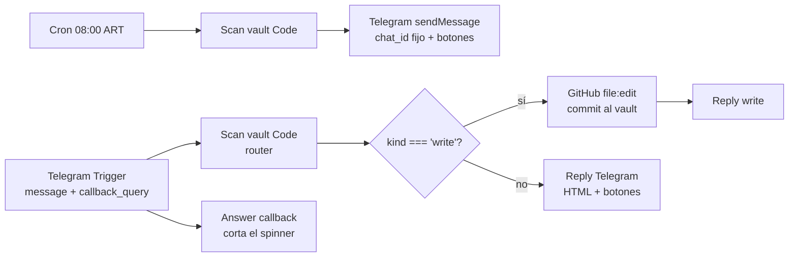

---
tags:
  - n8n
  - plan
  - innova
  - nivel-3
client: innova
flow: obsidian-pending-telegram-bot
status: live
updated: 2026-06-11
---

# Plan — Obsidian pending → Telegram bot

← Volver a [[n8n/METHODOLOGY|Methodology]] · [[n8n/clients/innova/flows/obsidian-pending-telegram-bot/spec|Spec]]

> Dos workflows que comparten el **mismo Code node router** (motor de scan + comandos). Sin LLM.

---

## Architecture

## Workflows

| Workflow | ID | Trigger | Estado |
| --- | --- | --- | --- |
| Innova · Pendientes diario | `c4sCjnMYbPV7TcH3` | Schedule `0 8 * * *` ART | active |
| Innova · Pendientes on-demand | `PIrXkj0OwdDLRRwH` | Telegram Trigger (`message`+`callback_query`) | active |

## Scan vault (Code node) — router

1. **Parsea el comando** de `message.text` o `callback_query.data` → `cmd` + `arg`. Alias (`start/hola/vacío`→`all`, `menu/ayuda`→`help`, `urgente`→`bloqueantes`). Si no es comando conocido → filtro por cliente.
2. **Cache de archivos (60s)** en static data (`SD._fc`/`SD._fcTs`): la primera consulta baja el repo (`git/trees` + `Promise.all` de raw, `$helpers.httpRequest`); las siguientes 60s reusan el cache → ejecuciones rápidas, sin saturar bajo botones seguidos.
3. **Lectura** (`READ`): computa y devuelve `{kind:'read', message}`. Parse curado: frontmatter (`estado`/`status`), checkboxes **section-aware**, discovery sin responder, resumen de flows por `status`; clasifica en buckets; dedup; diff contra snapshot.
4. **Escritura** (`WRITE` = `tarea`/`nota`/`idea`/`hecho`): resuelve archivo destino (cliente reconocido → `clientes/<slug>.md`, si no → `inbox.md`), **lee el archivo fresco** (no del cache, para no pisar datos) e invalida el cache (`SD._fcTs=0`), computa el contenido nuevo (append `- [ ]` o toggle `- [x]`) y devuelve `{kind:'write', path, newContent, commitMsg, replyText}`.
5. **Render del digest:** HTML — título/secciones en `<b>`, cada proyecto en `<blockquote expandable>`; escapa solo el contenido dinámico (`out(msg,true)` no escapa las tags). Cap 6 ítems/proyecto, ítems a 100 chars, truncado seguro.

## Branching (on-demand `PIrXkj0OwdDLRRwH`)

- `Telegram Trigger` (updates `message`+`callback_query`) → `Scan vault` → `Es escritura?` (IF `kind==='write'`):
  - **true** → `Commit al vault` (GitHub `file:edit`, cred `github-innova-vault`, `filePath/fileContent/commitMessage` desde el router) → `Reply write`.
  - **false** → `Reply Telegram` (HTML + `inline_keyboard`).
- Rama paralela `Telegram Trigger` → `Answer callback` (`answerQuery`, `onError: continueRegularOutput` para los `message` que no traen `callback_query.id`).
- `chatId` de los replies: `($('Telegram Trigger').item.json.message || ...callback_query.message).chat.id`.

## Cross-cutting decisions

### Credentials
| Credential | n8n name (id) | Uso |
| --- | --- | --- |
| Telegram Bot | `telegram-innova-bot` (`4jMI1PFVR4RkqE3Y`) | bot `@innovaok_bot` (trigger + sends) |
| GitHub PAT | `github-innova-vault` (`ahSijtt5sOQRFKhv`) | commits de captura (fine-grained, Contents R/W sobre `kolimbas/obsidian_innova`) |

`chat_id` destino del push diario: `5719368566` (hardcodeado en el Send del diario).

> ⚠️ El PAT vive **solo** en la credencial n8n, nunca en archivos del repo. El push local del vault usa la SSH key `~/.ssh/innova_vault` (mecanismo aparte).

### Menú `/`
- `setMyCommands` (one-shot, `curl` a la Bot API) con `pendientes, clientes, hoy, bloqueantes, buscar, resumen, tarea, nota, hecho, help`. Persiste del lado de Telegram.

### Idempotency / estado
- Snapshot de pendientes en static data por-workflow. Solo el run **diario** (y `cmd==='all'` on-demand) actualiza el snapshot.

### Observability
- Ejecuciones en n8n. Si vuelve a aparecer lentitud/storm: revisar duración del Code node (el cache lo mantiene en ~1-2s).

### Gotchas (ver retro)
- Code node: `$helpers.httpRequest` y `$getWorkflowStaticData` (no `this.*`); `Date.now()` permitido.
- Telegram **parsea HTML por default** → escapar `& < >` del contenido (las tags no).
- `<blockquote expandable>` requiere Bot API 7.0+ (ok); el contenido colapsado igual cuenta para el límite de 4096.

## Risks & mitigations

| Risk | Mitigation |
| --- | --- |
| **Storm de reintentos del webhook** (ejecuciones lentas al tocar botones → Telegram reintrega) | **Cache de 60s** del vault → ejecuciones rápidas; ante incidente: `deleteWebhook?drop_pending_updates=true` + desactivar WF |
| Cache viejo pisa una escritura | La escritura **lee el archivo fresco** (bypassa cache) e invalida el cache tras commitear |
| El bot lee GitHub, no el Obsidian local | Auto-sync (SSH + systemd timer) pushea el vault cada ~10 min |
| Mensaje > 4096 chars | Cap por proyecto/ítem + truncado que cierra `</blockquote>` |
| Telegram solo permite 1 webhook por bot | Solo el on-demand usa webhook; el diario envía por API y sus botones caen en el webhook del on-demand |
