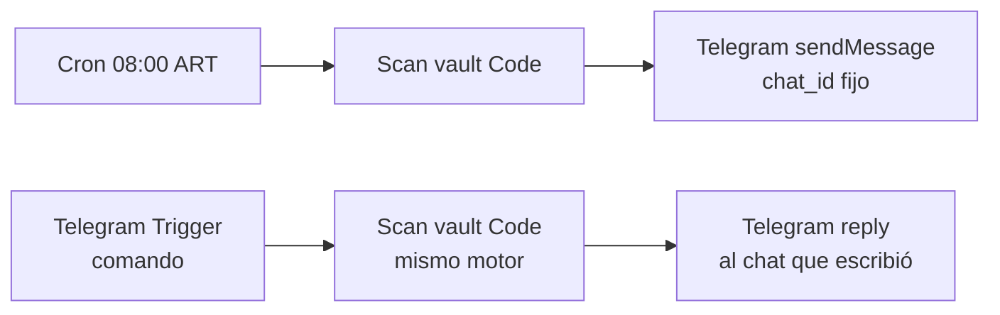

---
tags:
  - n8n
  - plan
  - innova
  - nivel-3
client: innova
flow: obsidian-pending-telegram-bot
status: live
updated: 2026-06-10
---

# Plan — Obsidian pending → Telegram bot

← Volver a [[n8n/METHODOLOGY|Methodology]] · [[n8n/clients/innova/flows/obsidian-pending-telegram-bot/spec|Spec]]

> Dos workflows que comparten el **mismo Code node** (motor de scan). Sin LLM.

---

## Architecture

## Workflows

| Workflow | ID | Trigger | Estado |
| --- | --- | --- | --- |
| Innova · Pendientes diario | `c4sCjnMYbPV7TcH3` | Schedule `0 8 * * *` ART | active |
| Innova · Pendientes on-demand | `PIrXkj0OwdDLRRwH` | Telegram Trigger (webhook) | active |

## Scan vault (Code node) — lógica

1. `GET git/trees/main?recursive=1` → lista de `.md` (1 request, repo público).
2. `Promise.all` de raw fetch de cada archivo (`$helpers.httpRequest`).
3. Parse curado: frontmatter (`estado`/`status`), checkboxes **section-aware** (solo bajo `[!todo]` / headings de pendientes), discovery sin responder, resumen de flows n8n por `status`.
4. Clasifica en buckets por `estado` del cliente. Dedup. Cap 6 ítems/proyecto.
5. Diff contra snapshot anterior (`$getWorkflowStaticData('global').pending`).
6. **Escapa `< > &`** (parse_mode HTML) y trunca a 4096.

## Cross-cutting decisions

### Credentials
| Credential | n8n name | Notes |
| --- | --- | --- |
| Telegram Bot | `telegram-innova-bot` (id `4jMI1PFVR4RkqE3Y`) | bot `@innovaok_bot` |

`chat_id` destino del push diario: `5719368566` (hardcodeado en el nodo Send del diario).

### Idempotency / estado
- El snapshot de pendientes vive en n8n static data por-workflow. Solo el run **diario** actualiza el snapshot (los on-demand no, para no pisar la línea de base del diff).

### Observability
- Ejecuciones en n8n (webhook/schedule). Errores visibles en la lista de executions.

### Gotchas (ver retro)
- En el Code node: usar **`$helpers.httpRequest`** y **`$getWorkflowStaticData`** (no `this.*`); el código tiene fallback a `this.*` por robustez.
- El nodo Telegram **parsea HTML por default** → hay que **escapar `< > &`** o rompe con `<client>`, `last_dunning_at`, etc.

## Risks & mitigations

| Risk | Mitigation |
| --- | --- |
| El bot lee GitHub, no el Obsidian local | Auto-sync (SSH + systemd timer) que pushea el vault cada ~10 min |
| Rate limit GitHub API (tree, 60/h sin auth) | 1 sola request de tree por corrida; volumen bajo |
| Mensaje > 4096 chars | Cap + truncado seguro (no corta entidad HTML) |
| Telegram solo permite 1 webhook por bot | Solo el on-demand usa webhook; el diario envía por API |
