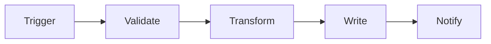

---
tags:
  - n8n
  - plan
client: <client-slug>
flow: <flow-slug>
updated: YYYY-MM-DD
---

# Plan — <Flow Title>

← [[spec|Spec]] · [[research|Research]] · [[tasks|Tasks]]

> Node-level architecture. Keep this in sync with what's actually built.

---

## Architecture

## Nodes

| # | Node | Type | Purpose | Key params | On error |
| --- | --- | --- | --- | --- | --- |
| 1 |  |  |  |  |  |
| 2 |  |  |  |  |  |

## Cross-cutting decisions

### Idempotency

- Dedup key:
- Strategy: upsert | lookup-then-insert | natural-key | external dedup table
- Why:

### Error handling

- Retry policy: <attempts × backoff>
- Dead-letter: <where>
- Alerting: <channel> on <condition>

### Credentials & secrets

| Credential | n8n credential name | Stored in | Owner |
| --- | --- | --- | --- |
|  |  |  |  |

No secrets inline. Anything not in n8n credentials goes in env vars referenced via `$env.*`.

### Observability

- Logs: where, what fields
- Run history: n8n executions retention
- Failure detection: alert source

### Testing

- Test payload(s): see `spec.md` § Inputs
- Environment: sandbox | prod-with-flag | prod
- Rollback: how to revert if something writes wrong data

## Risks & mitigations

| Risk | Likelihood | Impact | Mitigation |
| --- | --- | --- | --- |
|  |  |  |  |
